# Vice City Billboard Takeover — Make Your Mark

A cinematic, game-style creative experience. Design an ad, edit it in the
[Unlayer React Image Editor](https://github.com/unlayer/react-image-editor), then watch it take
over a fictional, 80s-soaked Vice City. There are eight spots:

- Ocean Drive billboard
- Starfish Causeway highway mega-board
- The Velvet club mega-screen
- Sunset Drive-In screen
- Vice Beach banner plane
- Palm Boulevard storefront marquee
- Starlight Avenue bus shelter (portrait)
- Cab 86 taxi topper

## Screenshots

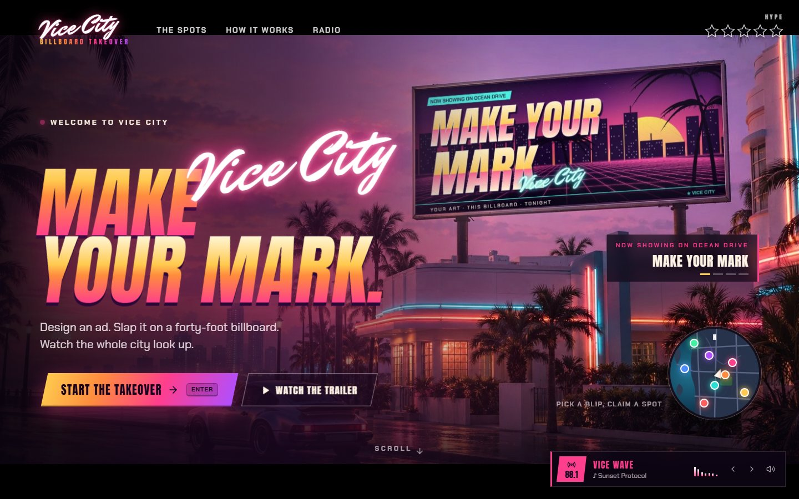

| | |
|---|---|
| 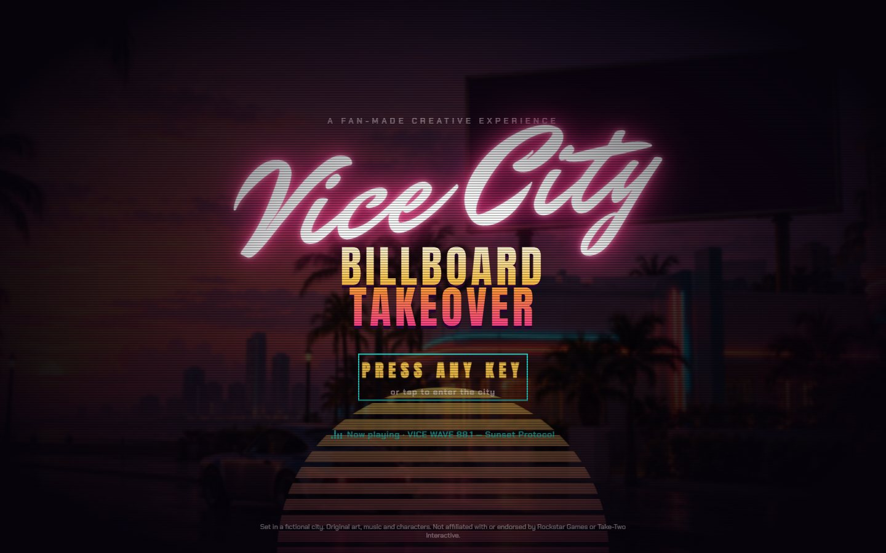 | 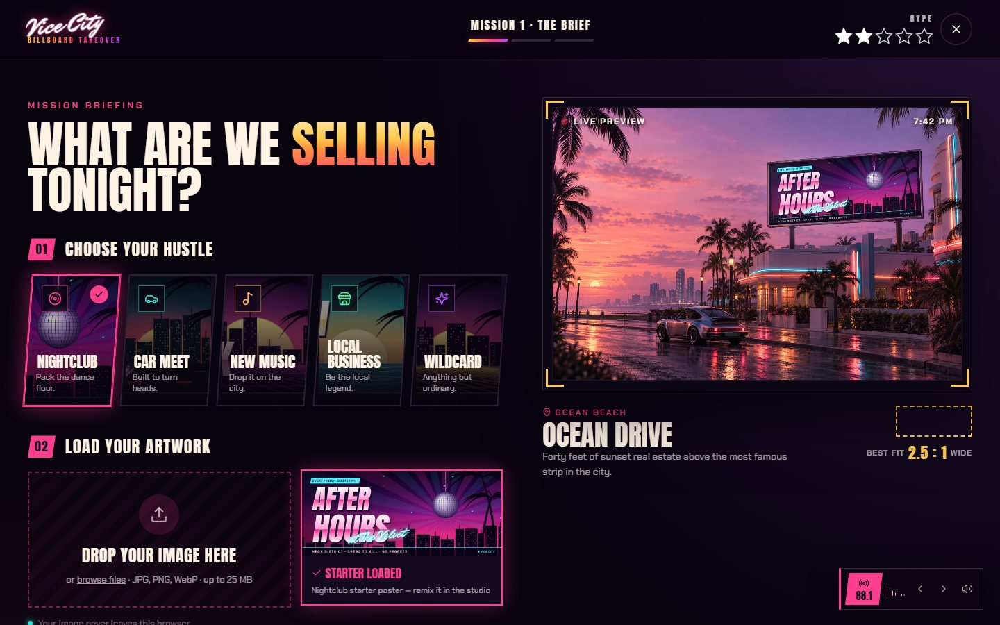 |
| **Title screen.** "Press any key", and VICE WAVE 88.1 starts. | **Mission 1 · The Brief.** Pick a hustle, load art, choose a spot, with a live preview. |

### The studio, built on the Unlayer React Image Editor

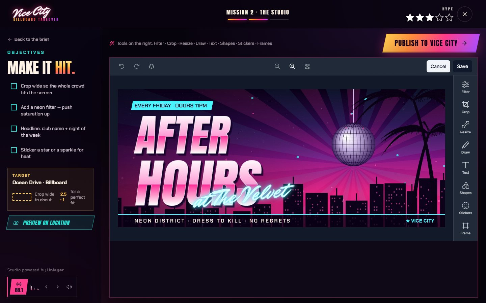

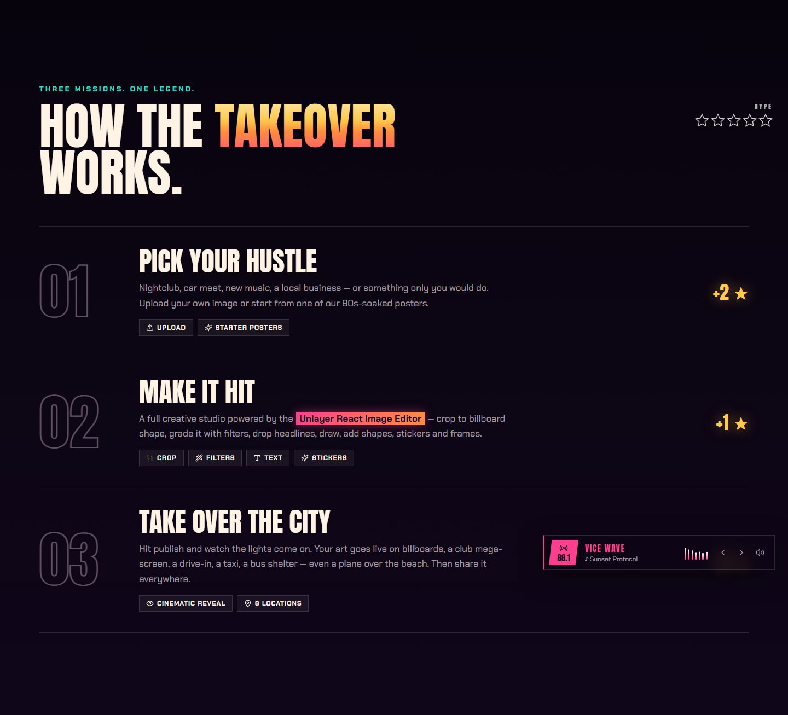

### The City Reacts: hijacking a billboard

| | |
|---|---|
| 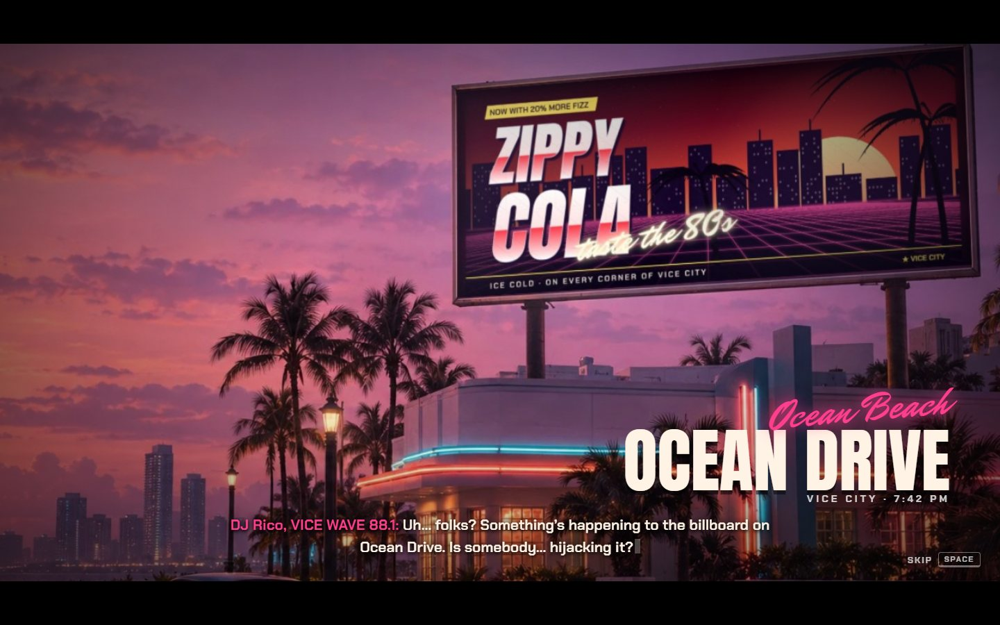 | 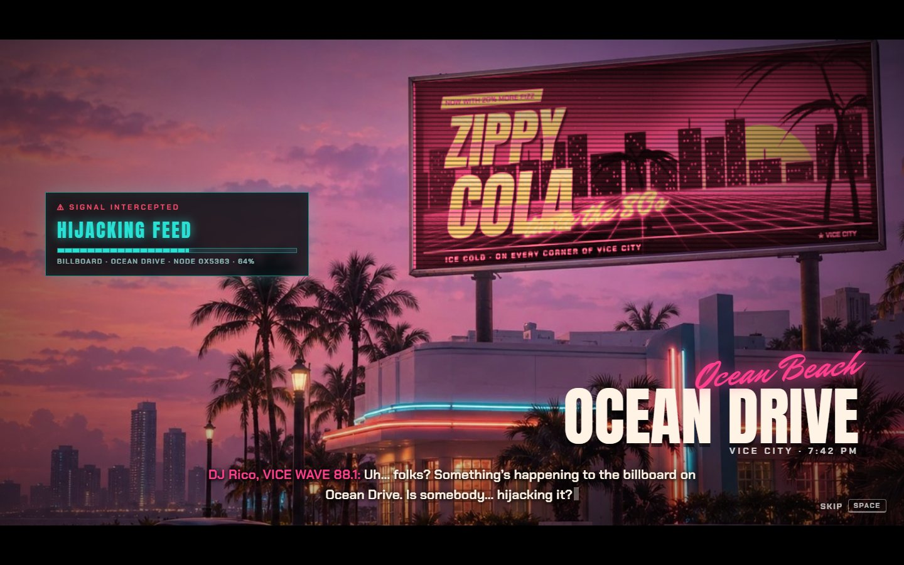 |
| **1. The approach.** A rival ad owns the billboard. DJ Rico notices something's wrong. | **2. The hijack.** The ad corrupts while the hack panel runs to ACCESS GRANTED. |
| 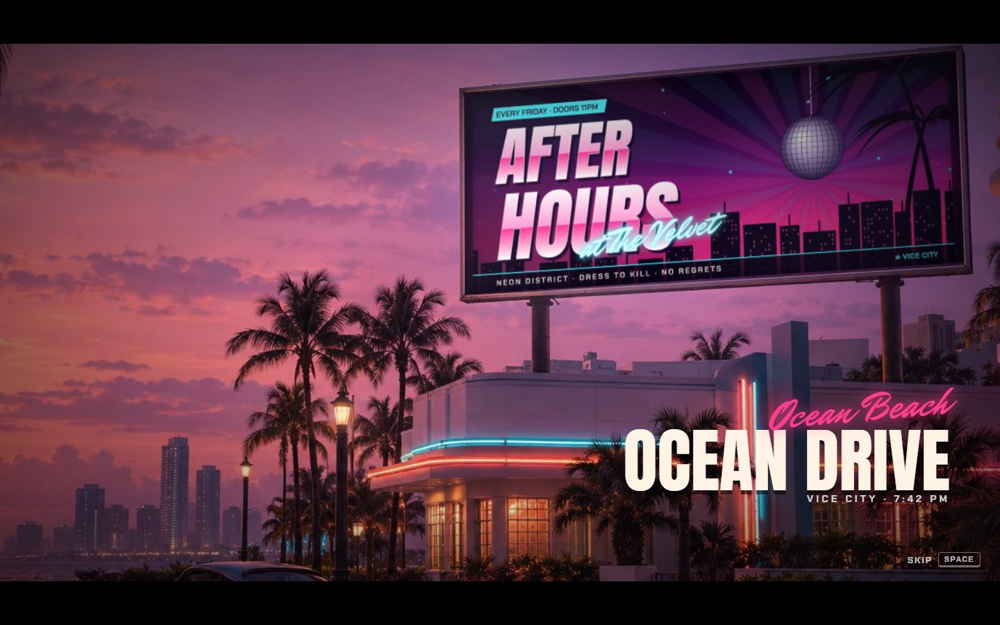 | 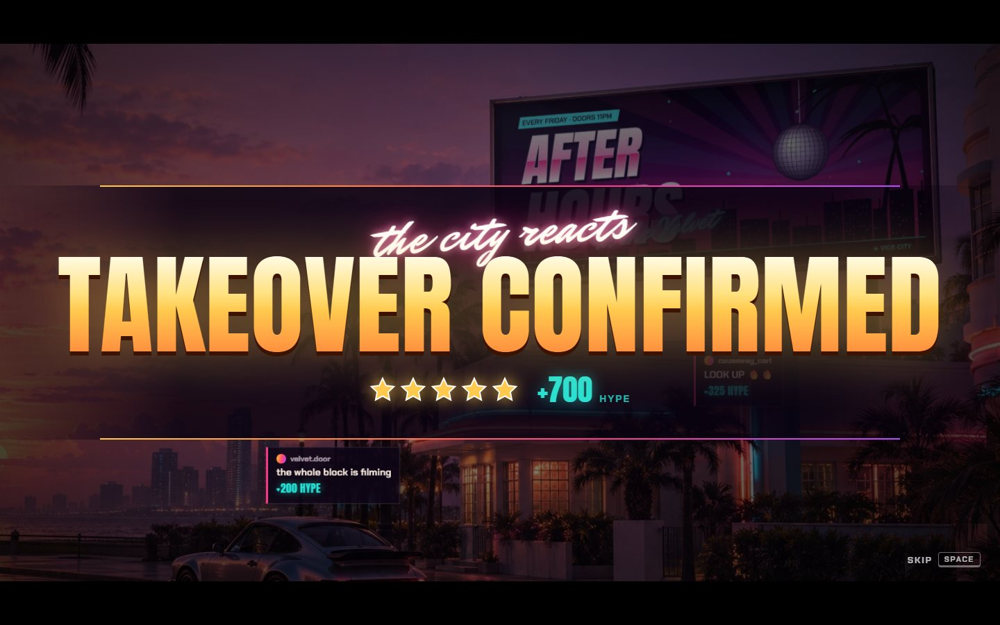 |
| **3. The switch.** Flash, impact, and your artwork flickers onto the sign. | **4. Takeover confirmed.** Crowd flashes and reactions push the HYPE score up. |

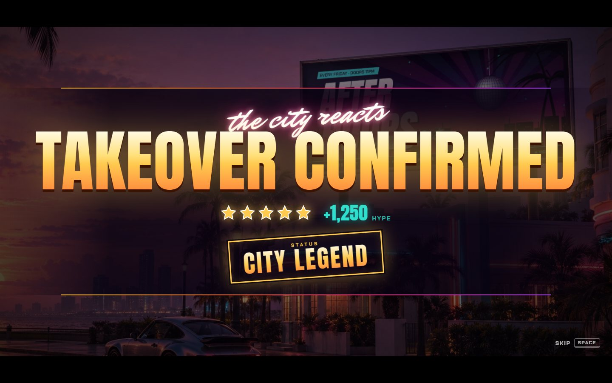

### Results and sharing

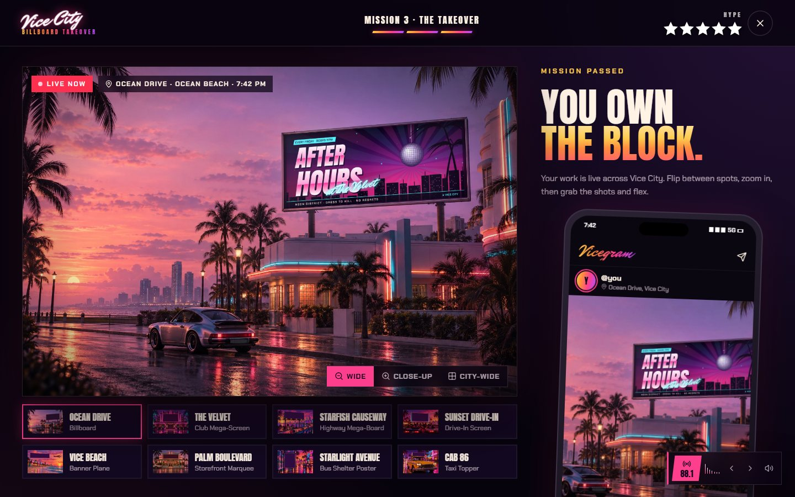

| | |
|---|---|
| 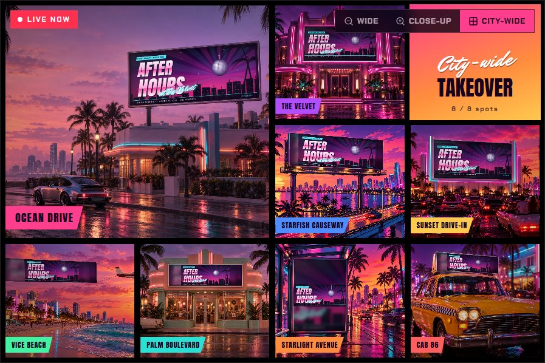 | 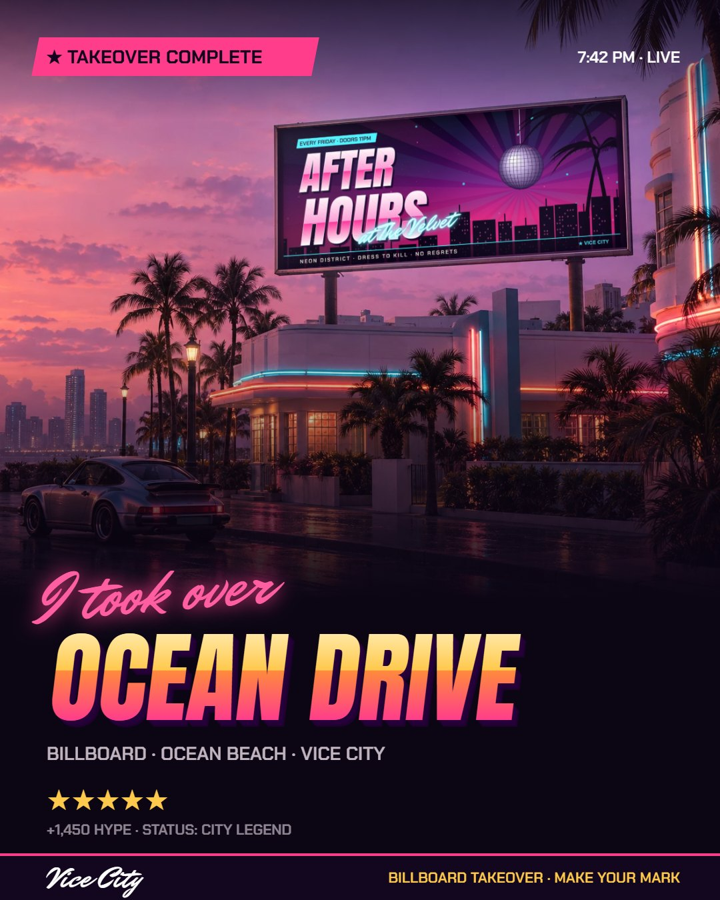 |
| **City-wide.** Your art on all 8 spots at once. | **Share card.** 1080×1350, ready for stories and feeds. |

| | |
|---|---|
| 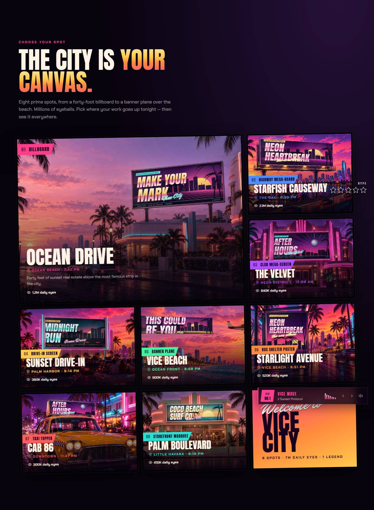 | 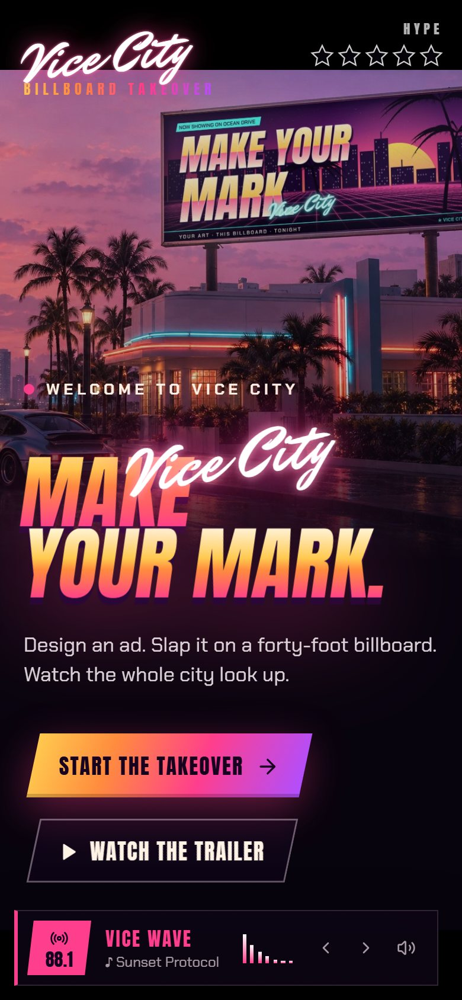 |
| **Eight spots** in a loading-screen collage. | **Mobile.** Every screen adapts to phones. |

Regenerate the screenshots with `npm run dev`, then `node scripts/capture-screenshots.mjs`.

## Built with the Unlayer React Image Editor

The creative studio is the official [Unlayer React Image Editor](https://github.com/unlayer/react-image-editor)
(`@unlayer/react-image-editor`), not a custom editor. Every artwork published to the city goes through it.

```tsx
import ImageEditor from '@unlayer/react-image-editor';

<ImageEditor
  image={sourceImage}
  options={{ theme: 'dark' }}
  onSave={({ dataUrl }) => publish(dataUrl)}   // becomes the billboard artwork
  onCancel={() => backToBrief()}
/>
```

Its tools each have a job in the flow:

- **Crop and resize:** match the shape of the chosen spot. The studio shows the target ratio for each location, for example 2.5:1 for Ocean Drive or 1:1.4 tall for the bus shelter.
- **Filters:** grade the art to the neon, sunset look.
- **Text, draw, shapes, stickers and frames:** add headlines, signatures and badges.
- **Publish:** the studio's **Publish to Vice City** button (or the editor's own **Save**) exports the edited image with `editor.getImage()` / `onSave`. The app then perspective-maps it onto the chosen sign.

See `src/Studio.tsx` for the integration.

## The flow

1. **Title screen:** "Press any key" (also unlocks audio).
2. **Landing:** a live billboard cycling ads, a minimap with location blips, a VCN news ticker, a loading-screen collage of all eight spots, the missions, and the radio stations.
3. **Mission 1 · The Brief:** choose a hustle (Nightclub, Car Meet, New Music, Local Business, Wildcard), upload an image or use a starter poster, and pick a spot. A live viewfinder shows the art in place.
4. **Mission 2 · The Studio:** the full Unlayer editor (crop, resize, filters, draw, text, shapes, stickers, frames), with category objectives, the target aspect ratio, and a "Preview on location" snapshot.
5. **Mission 3 · The Takeover, "The City Reacts":** a cinematic hijack in six beats.
   1. The camera pushes in on the chosen sign, which is showing a rival ad (ZIPPY COLA) while DJ Rico notices something's off.
   2. The ad glitches (RGB split, static, tearing) inside the sign's own frame while a hack panel runs SIGNAL INTERCEPTED → HIJACKING FEED → ACCESS GRANTED.
   3. A flash and impact, and the player's artwork flickers onto the sign. The banner plane unfurls instead.
   4. **TAKEOVER CONFIRMED.** Crowd camera flashes and reaction bubbles feed a rolling **HYPE** score (for example +1,250 HYPE), with a synthesized crowd cheer.
   5. A **CITY LEGEND** status stamp lands.
   6. A zoom transition leads to the result screen. The HYPE score is printed on the share card.
6. **Result:** wide, close-up and city-wide camera modes, switchable locations, and an in-game phone post that collects likes and comments. You can download a 1080×1350 share card, the full scene, or the artwork alone, or use native share.

## Sound

All audio is synthesized live with the Web Audio API, so there are no sample files or licensing issues.

- **Three original radio stations:** VICE WAVE 88.1 (synthwave), NIGHT DRIVE 99.9 (outrun) and PALM FM 102.4 (chillwave).
- **Controls:** press <kbd>Q</kbd> for the radio wheel and <kbd>M</kbd> to mute. Mute and station choices are remembered.
- **Sound effects:** UI blips, whooshes, shutter, neon buzz, impact, riser, cash register, takeover sting, and for the hijack: glitch bursts, hack beeps, access-granted chirp, camera snaps, reaction pops, crowd cheer and a rank-up fanfare.
- **Mood mixing:** the music is muffled while you edit and during the cutscene.

## Adding a location

1. Generate a 1536×1024 scene whose sign is a flat, blank, solid dark-purple rectangle.
2. Convert it to WebP in `public/images/`. `scripts/import-new-scenes.mjs` shows how.
3. Add an entry to `scenes` in `src/scenes.ts` with the sign's four corners (top-left, top-right, bottom-right, bottom-left, in 1536×1024 pixels). Every screen picks it up automatically.

## Run

```bash
npm install
npm run dev
```

## Deploy

```bash
npm run build
```

`dist/` is a static site, so you can deploy it to Vercel, Netlify, Cloudflare Pages or GitHub Pages as-is. The editor
loads from Unlayer's CDN, so the deployed site needs internet access.

## Structure

| File | Role |
| --- | --- |
| `src/App.tsx` | View state, loading-screen wipes, global UI sounds, HUD |
| `src/Boot.tsx` | Title screen / audio unlock |
| `src/Home.tsx` | Landing page |
| `src/Studio.tsx` | Brief, editor workspace, stage machine |
| `src/Reveal.tsx` | Cinematic reveal timeline |
| `src/Result.tsx` | Result viewer, phone feed, share-card export |
| `src/audio.ts` | Synth engine: radio sequencer and SFX |
| `src/posters.ts` | Runtime-painted starter posters (landscape and portrait) |
| `src/scenes.ts` | Location data and perspective-mapping renderer (bloom, LED pitch, fabric folds) |
| `src/ui.tsx` | Scene canvas, hype stars, radio widget and wheel, minimap |

Fan-made project set in a fictional city. Original art, music and characters. Not affiliated with or endorsed
by Rockstar Games or Take-Two Interactive.
